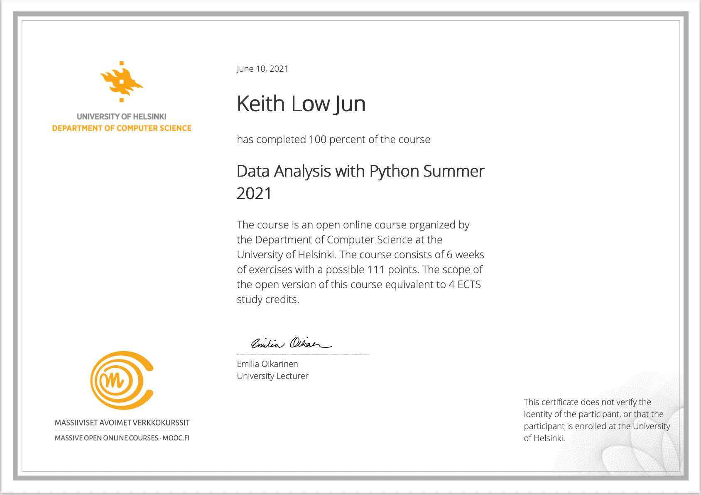

# Data Analysis With Python - Summer 2021
## An MOOC offered by the University of Helsinki

### The course is based on Jake VanderPlas' renowned book, _Python Data Science Handbook: Essential Tools for Working with Data_ 
https://jakevdp.github.io/PythonDataScienceHandbook/

Topics covered:

* Programming in Python 
* Numpy
* Pandas
* Matplotlib
* Machine learning with scikit-learn, including
  * Linear regression
  * Gaussian and Multinomial naive Bayes classification
  * KMeans, DBScan and Agglomerative clusering
  * Principal Component Analysis

 
 
